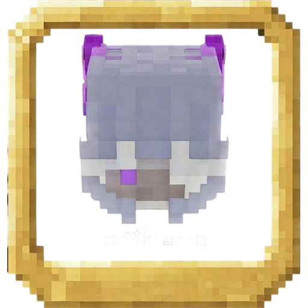

# KoHs Offhand Whitelist

[](https://github.com/kerlycanelita/KoHs-Offhand-Whitelist)
[](https://github.com/kerlycanelita/KoHs-Offhand-Whitelist/issues)
[](https://discord.gg/9t2VxEF7UU)

<p align="center">
  
</p>

**Decide which items are allowed in the offhand, so the wrong one never gets
there in the middle of a fight.**

Client-side Fabric mod. The offhand holds one slot and, in a fast exchange, the
thing that ends up in it is whatever the last `F` press happened to be pointing
at. A misfired swap costs a totem, or a shield, or the fight.

This mod keeps a whitelist. Anything not on it simply cannot reach the offhand.

## What it changes

- **Swap to offhand is filtered.** A swap key press carrying a non-whitelisted
  item is consumed instead of performed.
- **The offhand slot refuses non-whitelisted items** in the inventory screen, so
  they cannot be dragged or shift-clicked in either.
- **Container interactions are filtered on the same rule,** so the restriction
  does not have a way around it through a chest screen.

The whitelist is stored per item id, and potions are stored per variant — a
Strength potion and a Fire Resistance potion are separate entries, not one
`minecraft:potion`.

## The configuration screen

Open it from Mod Menu. It carries a searchable list of every item in the game,
ready-made **PvP presets**, and custom presets you can name and save yourself.

Two switches sit above all of it: one that turns the mod off entirely, and one
that turns only the whitelist off — useful for checking whether the mod is
responsible for something before removing it.

Settings live in `config/kohs_offhand_whitelist.json`.

## Compatibility

A dedicated compatibility mixin keeps **Shield Status** reading the correct
cooldown state while the whitelist is active. It is optional in both directions:
neither mod requires the other.

## Compatibility table

| Minecraft | Source |
|---|---|
| **26.1.2** | Repository root, and `version/26.1.2` |
| **1.21.6 – 1.21.11** | `version/1.21.6-1.21.11` |
| **1.21.2 – 1.21.5** | `version/1.21.2-1.21.5` |
| **1.21 – 1.21.1** | `version/1.21-1.21.1` |

The 26.1.2 build requires Fabric Loader 0.19.2 or newer, Fabric API
0.149.1+26.1.2 and Java 25. Each `version/` directory keeps its own compilation
status notes. Mod Menu is suggested, not required.

## Install

1. Install [Fabric Loader](https://fabricmc.net/use/) and Fabric API for your
   Minecraft version.
2. Put the `kohs-offhand-whitelist` JAR in the `mods` folder.
3. Install Mod Menu to reach the configuration screen.

## Building

```powershell
.\gradlew.bat build --no-daemon
```

The artifact is written to `build/libs/kohs-offhand-whitelist-1.0.2.jar`. To
build another target, run the same command from its `version/` directory.

`scripts/run_kohstest_matrix.ps1` drives the local test clients across every
supported version. Those client instances are not part of the repository.

## Issue page

`page issues/` is a small local Node service that collects bug reports through a
form and files each one with its screenshots. It is a development helper, not
something players need:

```bash
cd "page issues"
npm install
npm start
```

## License

All rights reserved.

## Credits

Made by **zymekoh**.
